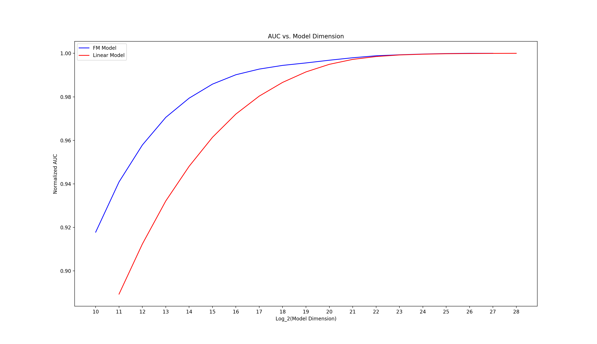
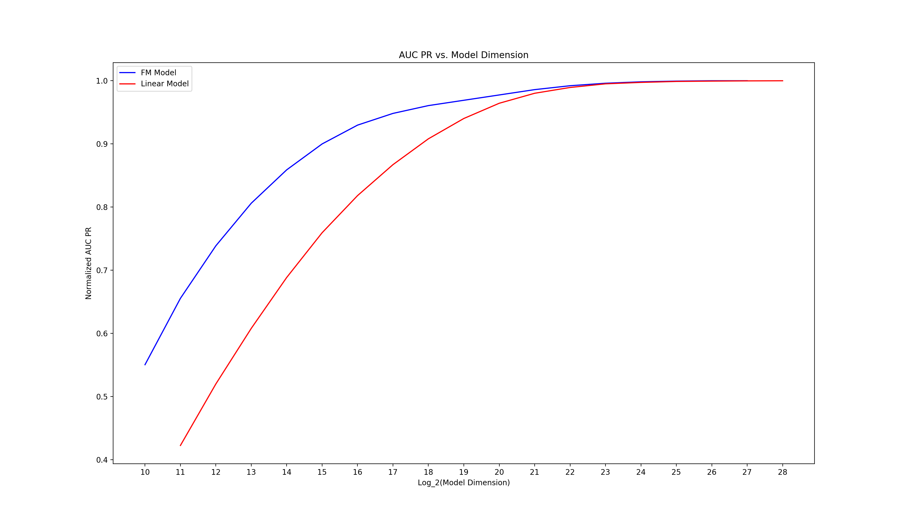
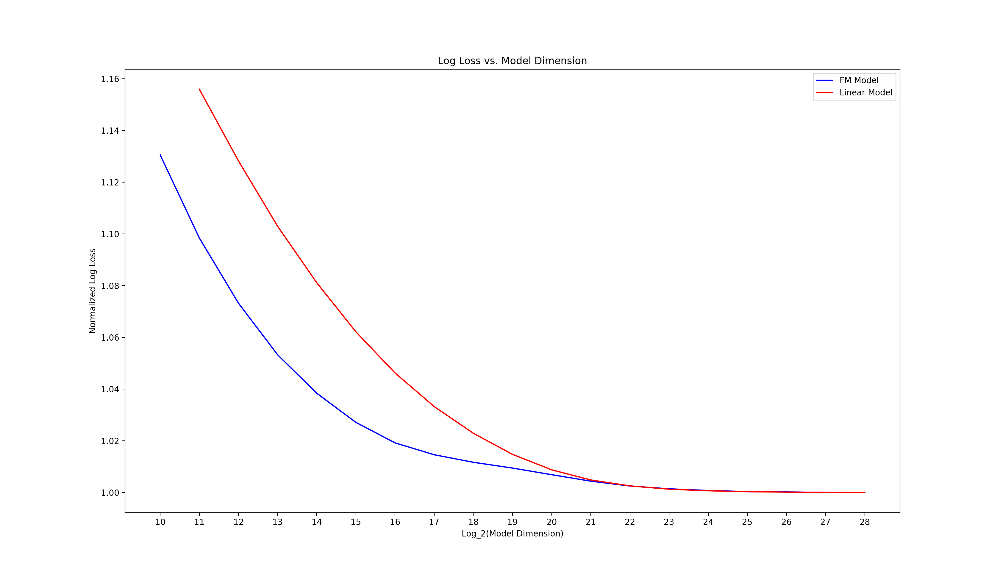
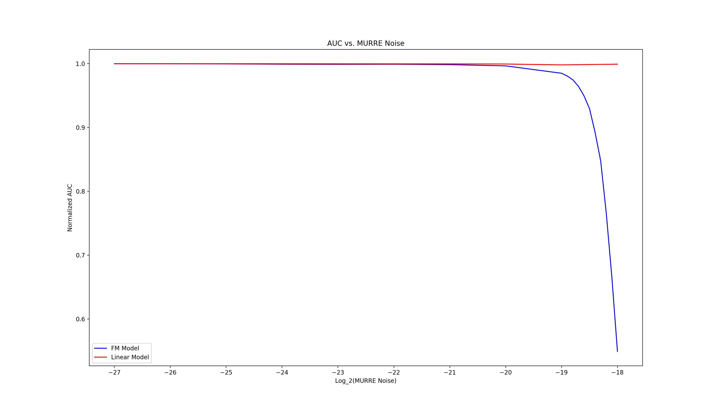
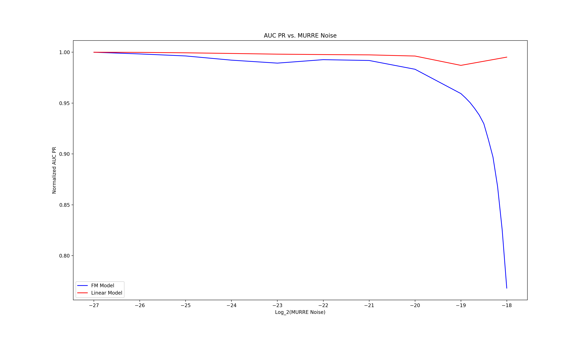
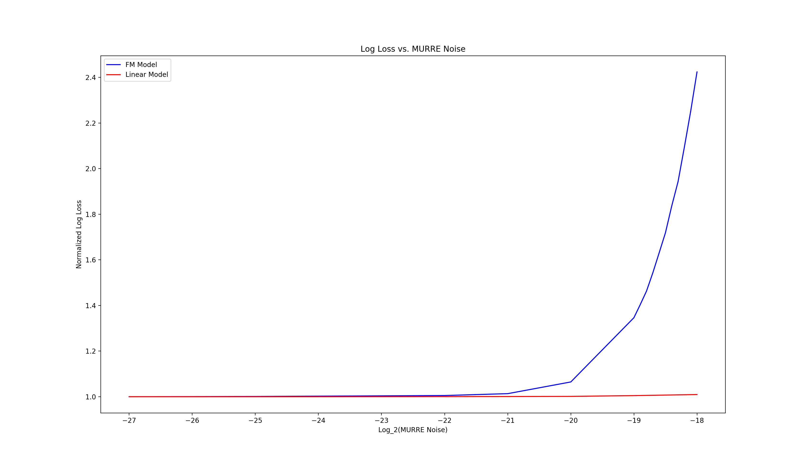

-   [MURRE](#murre)
    -   [Introduction](#introduction)
    -   [Authors](#authors)
    -   [Stakeholder Feedback /
        Opposition](#stakeholder-feedback-opposition)
    -   [Motivation](#motivation)
    -   [Related Work](#related-work)
    -   [MURRE’s Mathematics](#murres-mathematics)
        -   [A classic survey response
            mechanism](#a-classic-survey-response-mechanism)
        -   [Repeat this a lot](#repeat-this-a-lot)
        -   [The hashing trick](#the-hashing-trick)
        -   [Putting it together](#putting-it-together)
        -   [And what of epsilon?](#and-what-of-epsilon)
        -   [Selecting epsilon](#selecting-epsilon)
        -   [Weaknesses](#weaknesses)
    -   [MURRE’s Tech](#murres-tech)
        -   [The construction of “trails”](#the-construction-of-trails)
        -   [Feature extraction](#feature-extraction)
        -   [The browser computes z](#the-browser-computes-z)
        -   [Reporting through a proxy](#reporting-through-a-proxy)
    -   [Inference](#inference)
        -   [In TURTLEDOVE and TERN](#in-turtledove-and-tern)
        -   [SPARROW](#sparrow)
        -   [Dovekey](#dovekey)
    -   [Considered Alternatives](#considered-alternatives)
        -   [Conversion Measurement API](#conversion-measurement-api)
        -   [Aggregate Reporting API](#aggregate-reporting-api)
        -   [Reporting in SPARROW](#reporting-in-sparrow)
    -   [References](#references)

MURRE
=====

Mechanism for User Reports with Regulated Epsilon

Introduction
------------

The purpose of this document is to propose a new mechanism, MURRE, which
can be used for machine learning applications while maintaining privacy
in a differentially private way. Thus far, most other proposals have
focused on how advertisers can receive aggregate reports on things like
spend and performance. However, most machine learning infrastructure
requires logs at a more granular level to operate correctly.

MURRE is not a full-blown proposal, but a starting point for discussion.

Authors
-------

-   [Andrew Pascoe](https://github.com/appascoe)

Stakeholder Feedback / Opposition
---------------------------------

| Stakeholder | Sentiment |   Discussion    |
|:-----------:|:---------:|:---------------:|
|  NextRoll   | Interest  | (this document) |

Motivation
----------

Through recent discussions in the W3C, we have thus far been primarily
focused with the mechanisms that would enable ads to be displayed and
bids to be produced. However, an open question for all such proposals
thus far has been how optimization can occur with the current set of
reporting proposals. MURRE attempts to answer this question with a
relatively naive approach, but that is computationally feasible.

There are certain assumptions under which the MURRE proposal should be
taken:

-   Machine learning algorithms in ad tech require granular data to
    function well.

-   Ad tech uses models of high dimension, with sparse vectors.

-   Differential privacy is a framework for understanding and protecting
    user privacy.

-   The user data collected by MURRE is not particularly sensitive. (We
    will discuss this at length below.)

-   Global differential privacy demands a trusted curator with access to
    data in the clear and has inherent limits on the number and type of
    queries that can be run. Therefore, we favor a local differential
    privacy mechanism.

-   Computation and network usage should be limited on the user agent.
    We don’t want to hammer a user’s CPU or ship a lot of data back and
    forth between a variety of servers. This practically demands a
    non-interactive local differential privacy, NLDP, mechanism.

-   More favorable mechanisms with better performance should preclude
    MURRE.

Related Work
------------

As noted in \[5\], there has been very little research into NLDP for
even models such as linear regression. All current studies have produced
negative results in the feasibility of this framework. This brings a
tall order to the work at the W3C to bring strong privacy guarantees to
end users, while also supporting the overall ad tech ecosystem, as
revenue is largely supported by the efficacy of large machine learning
models on ad tech data.

\[1\] demonstrates that for convex optimization in an LDP mechanism, the
effective sample size of the collected data is
"),
where

is the privacy parameter and
 is the dimensionality
of the problem. Given the high dimensionality of ad tech models, this
implies that only a large

will counteract the reduced accuracy of models. We reserve our
justification of large

for a later discussion, but we should keep this general result in mind.

\[3\] notes that interactive LDP mechanisms for convex optimization
generally require as many back-and-forth rounds between the user and the
central server as there are users in the protocol. Clearly, for ad tech
this is not feasible. \[3\] explores how much this interactivity can be
reduced, and proposes a few algorithms. Unfortunately, these algorithms
depend on each user computing a binary tree with

leaves, where  is the
number of samples, or that the user receive a current version of the
model
,
which is likely to be in the gigabytes, to perform a gradient step.
Neither of these is feasible for our use case.

\[5\] studies sparse NLDP in the convex case and proposes two
algorithms. The first algorithm also demands sending

to every user and is thus infeasible. The second algorithm only protects
the labels in the dataset, but for ad tech, the browsing behavior is the
sensitive part we want to keep private, probably much moreso than the
labels, so this is also a non-starter.

\[4\] revisits the problem in \[5\] and proposes a new algorithm for
high dimensional cases. It requires a dimensional reduction to
, and the server
randomly generates a sub-Gaussian matrix of dimension
.
The seed can be sent to each user, but then the user must compute this
same matrix to transform their private data. For the sizes of
 that we’re talking
about, where a vector is in the gigabytes, it is not feasible for each
user to generate an

matrix and perform computations with it.

\[6\] has a set of algorithms that are not feasible for our use case, as
they hinge on each user applying a vector of Gaussian noise to their
private vector and sending it back to the server. This is a no-go
because the vector needs to be the size of the model, so each user would
be sending gigabytes over the wire. Sparsity likely needs to be
maintained through the network.

Apparently, there is very little in the literature to help us find a
differentially private way of receiving granular data from users.

MURRE’s Mathematics
-------------------

As stated previously, MURRE is a naive algorithm that is designed to be
computationally feasible at the expense of a large
.
This is a starting point for discussion, with the hope that at least
some concreteness in a proposal to achieve an optimization mechanism
spurs further creativity.

### A classic survey response mechanism

This section is entirely lifted from \[2\], page 29. Consider a survey
that asks a “yes/no” question where the response is embarrassing or
incriminating. Responders are asked to first flip a coin: if it comes up
heads, they answer truthfully; if it comes up tails, they flip again,
and if it comes up heads, they answer “yes”, otherwise “no.” This is a
differentially
private mechanism:

}{\mathbb{P}(\mathrm{Response} = \mathrm{Yes}\ |\ \mathrm{Truth} = \mathrm{No})} \\
 &= \log \frac{\mathbb{P}(\mathrm{Response} = \mathrm{No}\ |\ \mathrm{Truth} =
  \mathrm{No})}{\mathbb{P}(\mathrm{Response} = \mathrm{No}\ |\ \mathrm{Truth} = \mathrm{Yes})} \\
 &= \log \frac{3 / 4}{1 / 4} \\
 &= \log 3\end{aligned}")

This gives respondents a plausible deniability: their answer could have
been the result of random chance, but the analyst can use knowledge of
the mechanism to determine roughly what the true proportion of “yes”
responses should have been.

Of course, we can generalize this such that the first flip is a
Bernoulli trial with probability
, and the second flip,
if needed, is still fair. We would then have:

![\\begin{aligned}
\\epsilon &\\ge \\log \\frac{\\mathbb{P}(\\mathrm{Response} = \\mathrm{Yes}\\ \|\\ \\mathrm{Truth} =
  \\mathrm{Yes})}{\\mathbb{P}(\\mathrm{Response} = \\mathrm{Yes}\\ \|\\ \\mathrm{Truth} = \\mathrm{No})} \\\\
&= \\log \\frac{\\mathbb{P}(\\mathrm{Response} = \\mathrm{No}\\ \|\\ \\mathrm{Truth} =
  \\mathrm{No})}{\\mathbb{P}(\\mathrm{Response} = \\mathrm{No}\\ \|\\ \\mathrm{Truth} = \\mathrm{Yes})} \\\\
&= \\log \\frac{p + \\frac{1 - p}{2}}{\\frac{1 - p}{2}} \\\\
&= \\log \\frac{1 + p}{1 - p}\\end{aligned}](https://latex.codecogs.com/png.latex?%5Cbegin%7Baligned%7D%0A%5Cepsilon%20%26%5Cge%20%5Clog%20%5Cfrac%7B%5Cmathbb%7BP%7D%28%5Cmathrm%7BResponse%7D%20%3D%20%5Cmathrm%7BYes%7D%5C%20%7C%5C%20%5Cmathrm%7BTruth%7D%20%3D%0A%20%20%5Cmathrm%7BYes%7D%29%7D%7B%5Cmathbb%7BP%7D%28%5Cmathrm%7BResponse%7D%20%3D%20%5Cmathrm%7BYes%7D%5C%20%7C%5C%20%5Cmathrm%7BTruth%7D%20%3D%20%5Cmathrm%7BNo%7D%29%7D%20%5C%5C%0A%26%3D%20%5Clog%20%5Cfrac%7B%5Cmathbb%7BP%7D%28%5Cmathrm%7BResponse%7D%20%3D%20%5Cmathrm%7BNo%7D%5C%20%7C%5C%20%5Cmathrm%7BTruth%7D%20%3D%0A%20%20%5Cmathrm%7BNo%7D%29%7D%7B%5Cmathbb%7BP%7D%28%5Cmathrm%7BResponse%7D%20%3D%20%5Cmathrm%7BNo%7D%5C%20%7C%5C%20%5Cmathrm%7BTruth%7D%20%3D%20%5Cmathrm%7BYes%7D%29%7D%20%5C%5C%0A%26%3D%20%5Clog%20%5Cfrac%7Bp%20%2B%20%5Cfrac%7B1%20-%20p%7D%7B2%7D%7D%7B%5Cfrac%7B1%20-%20p%7D%7B2%7D%7D%20%5C%5C%0A%26%3D%20%5Clog%20%5Cfrac%7B1%20%2B%20p%7D%7B1%20-%20p%7D%5Cend%7Baligned%7D "\begin{aligned}
\epsilon &\ge \log \frac{\mathbb{P}(\mathrm{Response} = \mathrm{Yes}\ |\ \mathrm{Truth} =
  \mathrm{Yes})}{\mathbb{P}(\mathrm{Response} = \mathrm{Yes}\ |\ \mathrm{Truth} = \mathrm{No})} \\
&= \log \frac{\mathbb{P}(\mathrm{Response} = \mathrm{No}\ |\ \mathrm{Truth} =
  \mathrm{No})}{\mathbb{P}(\mathrm{Response} = \mathrm{No}\ |\ \mathrm{Truth} = \mathrm{Yes})} \\
&= \log \frac{p + \frac{1 - p}{2}}{\frac{1 - p}{2}} \\
&= \log \frac{1 + p}{1 - p}\end{aligned}")

This, of course, matches our intuition. If
,
where the respondents never answer truthfully, then

(undifferentiated random response), and if
, then

(no privacy).

### Repeat this a lot

Suppose that a user has a feature vector
.
We can perform the same operation as above over every dimension of
.
For ease of analyis, we assume that every dimension is independent. We
would then have:

}{\prod_{i=1}^N \mathbb{P}(\mathrm{Response} = x_i\ |\ \mathrm{Truth} = \neg x_i)} \\
&= N \log \frac{1 + p}{1 - p}\end{aligned}")

And so

scales linearly with ,
which is unsurprising given that this is a composition of a
/(1 - p))")-differentially
private mechanism 
times. However, with large
, it would be
computationally infeasible to run this many Bernoulli trials in the
browser. We can rapidly compute the mechanism by drawing a couple
binomial variates. For large
 these are also
difficult to draw, but we can use a normal approximation. That is, the
indices that would need to have their bits flipped can be represented
as:

![\\begin{aligned}
  S = \\{ j\_\\kappa :& j\_\\kappa \\sim \\mathrm{Uniform}(\[N\]), \\\\
                   & \\kappa \\in \[\\left\\lfloor k\\right\\rfloor\], \\\\
                   & k \\sim \\mathcal{N}(h / 2, h / 4), \\\\
                   & h \\sim \\mathcal{N}(N(1-p), Np(1-p)) \\}\\end{aligned}](https://latex.codecogs.com/png.latex?%5Cbegin%7Baligned%7D%0A%20%20S%20%3D%20%5C%7B%20j_%5Ckappa%20%3A%26%20j_%5Ckappa%20%5Csim%20%5Cmathrm%7BUniform%7D%28%5BN%5D%29%2C%20%5C%5C%0A%20%20%20%20%20%20%20%20%20%20%20%20%20%20%20%20%20%20%20%26%20%5Ckappa%20%5Cin%20%5B%5Cleft%5Clfloor%20k%5Cright%5Crfloor%5D%2C%20%5C%5C%0A%20%20%20%20%20%20%20%20%20%20%20%20%20%20%20%20%20%20%20%26%20k%20%5Csim%20%5Cmathcal%7BN%7D%28h%20%2F%202%2C%20h%20%2F%204%29%2C%20%5C%5C%0A%20%20%20%20%20%20%20%20%20%20%20%20%20%20%20%20%20%20%20%26%20h%20%5Csim%20%5Cmathcal%7BN%7D%28N%281-p%29%2C%20Np%281-p%29%29%20%5C%7D%5Cend%7Baligned%7D "\begin{aligned}
  S = \{ j_\kappa :& j_\kappa \sim \mathrm{Uniform}([N]), \\
                   & \kappa \in [\left\lfloor k\right\rfloor], \\
                   & k \sim \mathcal{N}(h / 2, h / 4), \\
                   & h \sim \mathcal{N}(N(1-p), Np(1-p)) \}\end{aligned}")

Here,  represents how
many of the dimensions we would have to flip the fair coin for, and
 represents how many of
those dimensions we would have to flip bits on. Letting
 = \{
i: x_i = 1 \}"), we would have that:

 = (\nu(\mathbf{x}) \cup S) \setminus (\nu(\mathbf{x}) \cap S)\end{aligned}")

This process results in a private vector

which can be communicated to an advertiser for machine learning
purposes. Pseudocode will be presented later.

### The hashing trick

In ad tech practice, it would not be feasible in the browser to
construct an

of dimension  purely
from the categorical features, as it would require constructing a large
map, e.g. mapping all domains or URLs to a space of integers. To get
around this, the [hashing
trick](https://en.wikipedia.org/wiki/Feature_hashing) can be employed.
The hash function

where
![M = qN,\\ q \\in \[0, 1\]](https://latex.codecogs.com/png.latex?M%20%3D%20qN%2C%5C%20q%20%5Cin%20%5B0%2C%201%5D "M = qN,\ q \in [0, 1]")
compresses the space as it accepts collision.

We somewhat abuse differential privacy here, as
 is not a random
mechanism, but in practice, it can be treated as such. Rather than:

 \ge \sup \frac{\mathbb{P}(\mathbf{z}\ |\ \mathbf{x})}{\mathbb{P}(\mathbf{z}\ |\ \mathbf{x}')}\end{aligned}")

  
where the supremum is taken over all

and
.
We suggest:

![\\begin{aligned}
  \\exp(\\epsilon) \\ge \\frac{\\mathbb{P}(\\mathbf{z}\\ \|\\ \\mathbf{x})}{\\mathbb{E}\_{\\mathbf{x}'}\[\\mathbb{P}(\\mathbf{z}\\ \|\\
      \\mathbf{x}')\]} = \\frac{1}{1 / M} = M\\end{aligned}](https://latex.codecogs.com/png.latex?%5Cbegin%7Baligned%7D%0A%20%20%5Cexp%28%5Cepsilon%29%20%5Cge%20%5Cfrac%7B%5Cmathbb%7BP%7D%28%5Cmathbf%7Bz%7D%5C%20%7C%5C%20%5Cmathbf%7Bx%7D%29%7D%7B%5Cmathbb%7BE%7D_%7B%5Cmathbf%7Bx%7D%27%7D%5B%5Cmathbb%7BP%7D%28%5Cmathbf%7Bz%7D%5C%20%7C%5C%0A%20%20%20%20%20%20%5Cmathbf%7Bx%7D%27%29%5D%7D%20%3D%20%5Cfrac%7B1%7D%7B1%20%2F%20M%7D%20%3D%20M%5Cend%7Baligned%7D "\begin{aligned}
  \exp(\epsilon) \ge \frac{\mathbb{P}(\mathbf{z}\ |\ \mathbf{x})}{\mathbb{E}_{\mathbf{x}'}[\mathbb{P}(\mathbf{z}\ |\
      \mathbf{x}')]} = \frac{1}{1 / M} = M\end{aligned}")

The numerator is 1 because
 is deterministic, and
the denominator assumes a well-distributed hash where an arbitrary

can expect to be mapped to a particular

with a probability of
. Despite the
abuse, this makes intuitive sense: for
,
where everything gets mapped to a single value, results in a
0-differentially private mechanism as all the original data is
destroyed. Things break down a bit when considering the space of hash
functions where
, as a
perfect hash would be
-differentially
private instead of
-differentially
private (no other

could result in
).
But for practical purposes, we believe this interpretation is suitable.

### Putting it together

Now our mechanism is to first perform the hashing trick and then create
the randomized response on the hashed space.

![\\begin{aligned}
  \\exp(\\epsilon) &\\ge
  \\frac{\\mathbb{P}(\\mathbf{z}\\ \|\\ \\mathbf{x})}{\\mathbb{P}(\\mathbf{z}\\ \|\\ \\mathbf{x}')} \\\\
  &= \\frac{\\mathbb{P}(H(\\mathbf{x})\\ \|\\ \\mathbf{x}) \\prod\_{i = 1}^M \\mathbb{P}(z\_i\\ \|\\ H(\\mathbf{x})\_i)}{
    \\mathbb{E}\_{\\mathbf{x}'}\[\\mathbb{P}(H(\\mathbf{x})\\ \|\\ \\mathbf{x}')\] \\prod\_{i = 1}^M
    \\mathbb{P}(z\_i\\ \|\\ \\neg H(\\mathbf{x})\_i)} \\\\
  &= M \\left( \\frac{1 + p}{1 - p} \\right)^M \\\\
  \\epsilon &\\ge M \\log \\frac{1 + p}{1 - p} + \\log M\\\\
  &= qN \\log \\frac{1 + p}{1 - p} + \\log qN\\end{aligned}](https://latex.codecogs.com/png.latex?%5Cbegin%7Baligned%7D%0A%20%20%5Cexp%28%5Cepsilon%29%20%26%5Cge%0A%20%20%5Cfrac%7B%5Cmathbb%7BP%7D%28%5Cmathbf%7Bz%7D%5C%20%7C%5C%20%5Cmathbf%7Bx%7D%29%7D%7B%5Cmathbb%7BP%7D%28%5Cmathbf%7Bz%7D%5C%20%7C%5C%20%5Cmathbf%7Bx%7D%27%29%7D%20%5C%5C%0A%20%20%26%3D%20%5Cfrac%7B%5Cmathbb%7BP%7D%28H%28%5Cmathbf%7Bx%7D%29%5C%20%7C%5C%20%5Cmathbf%7Bx%7D%29%20%5Cprod_%7Bi%20%3D%201%7D%5EM%20%5Cmathbb%7BP%7D%28z_i%5C%20%7C%5C%20H%28%5Cmathbf%7Bx%7D%29_i%29%7D%7B%0A%20%20%20%20%5Cmathbb%7BE%7D_%7B%5Cmathbf%7Bx%7D%27%7D%5B%5Cmathbb%7BP%7D%28H%28%5Cmathbf%7Bx%7D%29%5C%20%7C%5C%20%5Cmathbf%7Bx%7D%27%29%5D%20%5Cprod_%7Bi%20%3D%201%7D%5EM%0A%20%20%20%20%5Cmathbb%7BP%7D%28z_i%5C%20%7C%5C%20%5Cneg%20H%28%5Cmathbf%7Bx%7D%29_i%29%7D%20%5C%5C%0A%20%20%26%3D%20M%20%5Cleft%28%20%5Cfrac%7B1%20%2B%20p%7D%7B1%20-%20p%7D%20%5Cright%29%5EM%20%5C%5C%0A%20%20%5Cepsilon%20%26%5Cge%20M%20%5Clog%20%5Cfrac%7B1%20%2B%20p%7D%7B1%20-%20p%7D%20%2B%20%5Clog%20M%5C%5C%0A%20%20%26%3D%20qN%20%5Clog%20%5Cfrac%7B1%20%2B%20p%7D%7B1%20-%20p%7D%20%2B%20%5Clog%20qN%5Cend%7Baligned%7D "\begin{aligned}
  \exp(\epsilon) &\ge
  \frac{\mathbb{P}(\mathbf{z}\ |\ \mathbf{x})}{\mathbb{P}(\mathbf{z}\ |\ \mathbf{x}')} \\
  &= \frac{\mathbb{P}(H(\mathbf{x})\ |\ \mathbf{x}) \prod_{i = 1}^M \mathbb{P}(z_i\ |\ H(\mathbf{x})_i)}{
    \mathbb{E}_{\mathbf{x}'}[\mathbb{P}(H(\mathbf{x})\ |\ \mathbf{x}')] \prod_{i = 1}^M
    \mathbb{P}(z_i\ |\ \neg H(\mathbf{x})_i)} \\
  &= M \left( \frac{1 + p}{1 - p} \right)^M \\
  \epsilon &\ge M \log \frac{1 + p}{1 - p} + \log M\\
  &= qN \log \frac{1 + p}{1 - p} + \log qN\end{aligned}")

And, sure enough, the
s
add. However, critically, the random response mechanism is now over
dimension

instead of . As a sanity
check, note that if
,
then this expression reduces to
,
which is exactly the same privacy as in the single random response case,
which is what we would expect as
.

### And what of epsilon?

This is perhaps the most crucial problem to solve. In a very real sense,
the way the ad tech industry operates today is with
 and
,
which offers no privacy at all under the definition of local
differential privacy. This means that any

and/or any
 is
an improvement over the current state of the art as far as privacy is
concerned.

Yet the accuracy of ad tech models are crucial to the economics of the
open web today. When research (\[1\]) thus far indicates a sample
degradation of

for convex optimization in NLDP, in order to prop up accuracy,

must be large to counteract the typical high dimensions of
. We have no theoretical
analysis of achieving a desired accuracy
 in
MURRE with respect to any of the configurable parameters (though given
its simplicity empirical results are very plausible to construct). But
regardless of this, all signs point to a large
.

But is this really that much of an issue? To quote from \[2\], page 25:

> But what of large values for
> ?
> Failure to be
> ")-differentially
> private merely says there exist neighboring databases and an output
>  for which the ratio
> of probabilities of observing
>  conditioned on the
> database being, respectively,
>  or
> , is large. An output
> of  might be very
> unlikely (this is addressed by
> ")-differential
> privacy); databases 
> and  might be terribly
> contrived and unlikely to occur in the “real world”; the adversary may
> not have the right auxiliary information to recognize that a revealing
> output has occurred; or may not know enough about the database(s) to
> determine the value of their symmetric difference. Thus, much as a
> weak cryptosystem may leak anything from only the least significant
> bit of a message to the complete decryption key, the failure to be
> ")-
> or
> ")-differentially
> private may range from effectively meaningless privacy breaches to
> complete revelation of the entire database. A large epsilon is large
> after its own fashion.

So, as an industry, we should consider how much privacy is actually
being leaked by having a large
.

Let’s consider the MURRE mechanism specifically. The original data is
hashed by the browser (to be described below as we get into the
technical aspects of the proposal). That vector is then noised, likely
with a high  to maintain
sparsity, which means most dimensions that were originally set to 1 will
not be flipped to a 0. But the DSP receives this vector with no ties to
an individual user identifier.

In principle, the DSP could choose a publisher’s URL to hash and choose
an advertiser’s URL to hash, which would tell them the dimensions to
look for 1 in their noised dataset, which could then be interpreted as
saying at some point a visitor to the advertiser’s site also visited
this publisher’s site. But those dimensions could also be set to 1
because of a hash collision, and then additionally, could have also been
set to 1 by the random response. This is the plausible deniability, but
is it plausible enough? For our part, we say yes.

Performing this at scale to be privacy-violating is exceedingly
unlikely. It’s simply too many things to hash and search for in the
dataset to make any detailed claims about user browsing behavior. And,
as stated, there are no user identifiers available directly in the
dataset. If a DSP attempts to use user identifiers as part of their
original feature set, that will only increase the number of collisions
in the hash space, further increasing plausible deniability.

Finally, we should keep in mind that differential privacy treats the 0s
just as valuably as the 1s, which inflates
.
In a strict mathematical sense, this is completely justifiable. For the
application to ad tech, though, the 0s are not particularly
privacy-violating. Remember that

is sparse, so there are many, many 0s in a given vector. We claim that
not taking an action is not embarrassing. Even if it were, with the way
ad tech functions, the answer to a query such as “didn’t visit website
” would be encoded as a
1 in some dimension. That is to say, under the definition of
differential privacy, a large epsilon should be expected. As in the
quote, “A large epsilon is large after its own fashion.”

So why all the analysis above if we don’t intend to hem and haw about
?
We care because it provides a benchmark to compare different solutions.
If another mechanism is proposed counter to MURRE that has the following
properties:

-   Is an NLDP mechanism so we’re comparing apples to apples

-   Is computationally feasible

-   Is acceptable to the broader industry

-   Achieves a better
    
    than MURRE under the same
    

then such a proposal should displace MURRE. The combination of

and 
provides a benchmark to evaluate competing proposals.

### Selecting epsilon

We do not recommend selecting an

directly, but rather having it defined through a selection of both
 and
 based on technical and
accuracy concerns. While we don’t have a theoretical analysis of how
these parameters affect model performance, we can provide an empirical
analysis.

The choice of  has very
little to do with the technical side of things. We would hope that
)| \approx |\nu(\mathbf{x})|").
For privacy reasons, it’s good to have
 be as small as possible
without any significant impact on accuracy.

So we ran some tests. We chose a baseline performance where
,
and we ran models by powers of two all the way down to
.
These were run over a CTR dataset with two types of logistic models: one
that is purely linear, and one second-order model that employs
[Factorization Machines
(FM)](https://www.csie.ntu.edu.tw/~b97053/paper/Rendle2010FM.pdf). FM
picks up interaction between terms, and we see that it’s more robust to
hash collisions than the purely linear model. We looked at three
metrics: AUC-ROC, AUC-PR (precision-recall), and log-loss:

<figure>
<figcaption aria-hidden="true">Relative AUC-ROC as a function of M</figcaption>
</figure>

<figure>
<figcaption aria-hidden="true">Relative AUC-PR as a function of M</figcaption>
</figure>

<figure>
<figcaption aria-hidden="true">Relative log-loss as a function of M</figcaption>
</figure>

 is quite different. A
very small , though very
private, will begin to densify
.
This will drastically increase the amount of data we have to send over
the wire under a resonably sized
. Thus,
 should have a lower
bound to ensure the feasibility of the proposal. From there, we also
need  to be large enough
to not have a detrimental impact on accuracy.

For these reasons, we ran experiments with
 ranging from

for

with a fixed
.
These values are all very close to 1, which means we’re asking the
browser to tell the truth very often, but note the amount of ones we’re
actually adding to the vector, on average:

This is a completely reasonable size to send over the wire, a mere 256
additional integers to send. From a data interpretation perspective,
this could be 256 different domains the user visited, 256 different
advertisers, or campaigns, or ads, or any combination of these. We
believe that this adds quite a bit of plausible deniability to the
user’s data. Here’s what we see:

<figure>
<figcaption aria-hidden="true">Relative AUC-ROC as a function of p</figcaption>
</figure>

<figure>
<figcaption aria-hidden="true">Relative AUC-PR as a function of p</figcaption>
</figure>

<figure>
<figcaption aria-hidden="true">Relative log-loss as a function of p</figcaption>
</figure>

Note that we didn’t change our hyperparameters at all from what we do
today, so maybe performance can be eked out beyond what we see here, but
we didn’t want to fiddle with too many variables at once. The purely
linear model fares quite well, whereas the FM model suffers a steep
dropoff. We have some theories around this, but these are beyond the
scope of this document.

### Weaknesses

MURRE certainly has weaknesses, but we think it’s a good starting point
for discussion. Here are a few that come to mind readily:

-   MURRE only supports binary vectors. While continuous values can be
    binned to become categorical, perhaps this is too restrictive. Maybe
    MURRE can be extended to support continuous values natively, but the
    concern here would be destroying the sparsity of the vector as the
    0s would have to undergo continuous noising as well. It also
    drastically complicates the analysis.

-   MURRE assumes independence in all dimensions. Of course, some
    dimensions will be highly, if not perfectly, correlated, e.g. a
    particular ad is always attached to the same advertiser. Lacking
    independence will increase
    ,
    but these dependent relationships will vary by DSP and would have
    ground the analysis to a halt.

-   MURRE also treats all
    s
    as equally probable, when in reality more common vectors benefit
    from greater privacy than very unique ones. Once again, the
    distribution on these datasets will vary by DSP, and so to make any
    progress, we made this assumption.

MURRE’s Tech
------------

In this section, we discuss the interfaces and dataflows that would
actually make MURRE function. As a quick overview, there are a few key
mechanisms:

1.  The browser collects a list of events for each DSP.

2.  The DSP provides a feature extraction function.

3.  This same feature extraction function is also capable of producing
    labels.

4.  On certain events, like impressions, clicks, and conversions, the
    browser evaluates this function to produce the set of features.

5.  The browser hashes each element of this set with a publicly known
    hash function.

6.  The browser carries out the random response mechanism.

7.  The browser encrypts the vector with the DSP’s public key.

8.  The browser sends the encrypted payload to a proxy server.

9.  The proxy server forwards the payload to the DSP for decryption and
    logging.

After this, we will also discuss how models can be derived and deployed
to operate in mechanisms where advertiser and publisher/contextual data
are uncorrelated, such as
[TURTLEDOVE](https://github.com/WICG/turtledove),
[TERN](https://github.com/WICG/turtledove/blob/master/TERN.md),
[SPARROW](https://github.com/WICG/sparrow), and
[Dovekey](https://github.com/google/rtb-experimental/tree/master/proposals/dovekey).

### The construction of “trails”

To create any useful vectors for machine learning, first a “trail” must
be created that captures the sequence of events the browser has
experienced. Later, a vector will be computed from this trail, but first
we describe how it’s constructed.

The browser starts with an empty list `trail = []` that is namespaced by
the DSP. The browser then visit’s an advertiser’s page, where the DSP’s
pixel writes interest groups into the browser. This becomes an event
that gets pushed into `trail`:

    trail.push({ 'advertiser': 'https://advertiser.example',
                 'timestamp': 1604013974,
                 'type': 'pixel',
                 'event_id': 'random_string_31287',
                 'data': { 'groups': ['group1', 'group2'],
                           'products': ['product1'],
                           ... // all sorts of other data }
               })

The `’event_id’` is a random string generated by the browser and it will
never leave the browser. It will become important later for identifying
trigger events. Later, the browser is served an impression for this
advertiser. Only the browser knows this, and it pushes another object
into `trail`:

    trail.push({ 'advertiser': 'https://advertiser.example',
                 'timestamp': 1604014974,
                 'type': 'impression',
                 'event_id': 'random_string_123989',
                 'data': { 'ad-name': 'ad12345',
                           'ad-size': '1024x768',
                           'url': 'https://publisher.example/path/to/page.html',
                           ... // all sorts of other data }
               })

The user clicks the ad, which creates another event:

    trail.push({ 'advertiser': 'https://advertiser.example',
                 'timestamp': 1604015000,
                 'type': 'click',
                 'event_id': 'random_string_9812387',
                 'data': { 'ad-name': 'ad12345',
                           'ad-size': '1024x768',
                           'url': 'https://publisher.example/path/to/page.html',
                           ... // all sorts of other data }
               })

And finally, the user converts on the advertiser’s site. This is another
`pixel`-type event, but the DSP is explicit about this, and instead we
push:

    trail.push({ 'advertiser': 'https://advertiser.example',
                 'timestamp': 1604018102,
                 'type': 'conversion',
                 'event_id': 'random_string_78123',
                 'data': { 'products': ['product2', 'product5'],
                           'conversion-value': 'USD$100',
                           ... // all sorts of other data }
               })

At this point, we would have:

    trail = [{ 'advertiser': 'https://advertiser.example',
               'timestamp': 1604018102,
               'type': 'conversion',
               'event_id': 'random_string_78123',
               'data': { 'products': ['product2', 'product5'],
                         'conversion-value': '1024x768',
                         ... // all sorts of other data }
             },
             { 'advertiser': 'https://advertiser.example',
               'timestamp': 1604015000,
               'type': 'click',
               'event_id': 'random_string_9812387',
               'data': { 'ad-name': 'ad12345',
                         'ad-size': '1024x768',
                         'url': 'https://publisher.example/path/to/page.html',
                         ... // all sorts of other data }
             },
             { 'advertiser': 'https://advertiser.example',
               'timestamp': 1604014974,
               'type': 'impression',
               'event_id': 'random_string_123989',
               'data': { 'ad-name': 'ad12345',
                         'ad-size': '1024x768',
                         'url': 'https://publisher.example/path/to/page.html',
                         ... // all sorts of other data }
             },
             { 'advertiser': 'https://advertiser.example',
               'timestamp': 1604013974,
               'type': 'pixel',
               'event_id': 'random_string_31287',
               'data': { 'groups': ['group1', 'group2'],
                         'products': ['product1'],
                           ... // all sorts of other data }
             }]

Recall that this list is namespaced by the DSP, not the advertiser.
There can be lots of advertisers mixed in this list, but we will address
this in the next section. Of course there can be multiple impressions,
multiple clicks, and so on.

Multiple pixel events in a row can be special, though. DSPs generally
just care about the complete state of a user before labeling an “event
of interest.” This full state can be communicated by the DSP in the
`’data’` object of pixel events, which means that we can perform an
update-in-place for any pixel events that come after the most recent
even of interest. In code:

    inserted = False
    if event.type == 'pixel':
      i = 0
      while i < length(trail):
        if trail[i].advertiser == event.advertiser:
          if trail[i].type == 'pixel':
            trail[i] = event
            inserted = True
            break
          else:
            trail.push(event)
            inserted = True
            break
        i += 1

    if not inserted:
      trail.push(event)

This is just a quick idea for storage optimization; perhaps it’s easier
to just use a fully granular list. We have no strong opinions on this.

We also note that the data to construct the pixel and conversion events
can be extracted from the `writeAdvertisementData()` as proposed in
[TERN](https://github.com/WICG/turtledove/blob/master/TERN.md). This
makes MURRE particularly synergistic with TERN, but MURRE is applicable
to the other proposals as well.

Though a full discussion of this is beyond the scope of this document,
we believe that these trails can also be leveraged for other use cases.
Things that immediately come to mind:

-   They could be used to generate reports for any future reporting
    APIs.

-   They can be used to implement arbitrary attribution mechanisms.

-   A UI could be layered over them to give users better insights into
    their data, potentially even broken down by individual advertiser.

-   Control mechanisms could be provided to the user for them to remove
    data they feel is personally sensitive: viewing certain products,
    visiting particular websites, etc.

### Feature extraction

The DSP provides an endpoint for the browser to call,
`https://dsp.example/.well-known/extraction`. This endpoint is
responsible for returning a JSON object containing a few necessary
pieces of information:

    { 
      'dsp-public-key': '2akdfj0wkadfjaksdjf',
      'feature-dimension': M,
      'label-dimension': L,
      'extraction-function-url': 'https://dsp.example/js/extraction.js'
    }

The public key is used for encryption and the feature dimension is the
same  as above. We also
introduce a new dimension
 for labels, which we
will discuss in this section. The extraction function will be the bulk
of what we describe here.

The extraction function is where a lot of the DSP’s “special sauce” is
contained. When a trigger event occurs in the browser for a given
advertiser, the browser constructs:

    advertiser_trail = [event for event in trail if event.advertiser == trigger_event.advertiser]

That is, the browser creates a sub-list of the full trail that only has
to do with the advertiser in question. This ensures that user data stays
siloed by advertiser for privacy reasons. From here, the browser
invokes:

    vector = extractor(advertiser_trail, event_id) {
      // all sorts of logic here
    }

This function returns this JSON `vector` object of the form:

    {
      'features': ['some_string_1', 'some_string_2', ..., 'some_string_t'],
      'labels': [1, 4]
    }

This is all very abstract (with reason), so let’s look at a basic
working example. We may have a simple `extractor()` function like:

    function extractor(trail, event_id) {
      features = []
      labels = []

      advertiser = trail[0].advertiser
      impressions = 0
      page_visits = 0
      
      for event in trail:
        if event.type == 'click':
          labels.push(1)
          continue
        // ... maybe some other types of labels
        if event.type == 'conversion':
          labels.push(7)
          continue
        if event.type == 'impression':
          impressions += 1
          continue
        if event.type == 'pixel':
          page_visits += 1
          continue

      features.push('{}:{}:{}'.format(advertiser, 'imps', impressions))
      features.push('{}:{}:{}'.format(advertiser, 'pvs', page_visits))

      return { 'features': features, 'labels': labels }
    }

(We’re not using the `event_id` here; we’ll cover this later when we
talk about trigger events.) Say we’re talking about a trail where the
browser saw 12 impressions from this advertiser after 3 page visits, and
the user clicked. Then the output would be:

    {
      'features': ['https://advertiser.example:imps:12',
                   'https://advertiser.example:pvs:3'],
      'labels': [1]
    }

For the `’features’` list, we’re encoding very clearly some of the user
browsing behavior related to this advertiser that the user has engaged
in. For the `’labels’` list, the DSP has chosen to assign dimension 1 to
indicating that a click has occurred, and expresses that here because
the user did indeed click. If the user took no positive action, this
would be an empty list.

The labeling mechanism allows some flexibility for DSPs to select the
types of models they want to build. However, the dimension
 expresses just how many
types of labels the DSP intends to construct. This `’labels’` list is
going to be sent in the clear, so
 cannot be too large. We
leave this open to discussion on what an appropriate value for
 is. However, if for
some reason, the extractor function returns an integer larger than
, the browser can check
this and invalidate the whole computation so the DSP gets nothing.

As for the features, these can appear privacy-invasive at first blush,
but that will soon change. Nothing has left the browser at this point.

Let us now talk about trigger events. As previously stated, DSPs are
largely concerned about the immediately prior feature set of the browser
before an event of interest occurs. Some very obvious trigger events
that are useful before a label:

-   Impressions: This entire extraction routine should be triggered by
    any impression event. It does not need to be triggered immediately,
    as, for example, whether to label a vector as having triggered a
    click will take some time for the user to click. The important thing
    is that the browser remember when and for which advertiser an
    impression event occurred and to compute the vector some reasonable,
    but random (to prevent timing attacks), time later. Just to throw a
    number out there, say we allow 2 hours for a user to click on an ad.
    Thus, on an impression event, the browser records
    `(timestamp, advertiser, event_id)`. Associated with this tuple, the
    browser generates a reporting time
    ").
    Once this reporting time is reached, the browser computes
    `advertiser_trail` and kicks off the rest of the extraction process,
    passing in the `event_id`.

    Note that this gives the DSP an opportunity in the extraction
    function to label the impression as either having been positively or
    negatively labeled. Since more impressions could have been served in
    between this trigger event and the reporting time, the `event_id`
    can be used by the extractor to identify specifically which
    impression should have its features extracted (like the publisher
    site, ad slot, etc.). The extractor can look forward from this event
    to decide if the impression was clicked or not.

-   Conversions: Conversions are another major event that should trigger
    the extraction process. Just like with impressions, this should be
    subject to a delay in extraction along with passing in the relevant
    `event_id`. Note that with the extractor function having access to
    the full trail, this allows DSPs to use whatever attribution
    mechanism(s) they wish for their labeling output. This level of
    flexibility is why we’re supportive of the browser maintaining the
    trail and allowing DSPs to specify their extractor functions as they
    see fit.

We exclude some event types from triggering a report:

-   Clicks: We have already described a mechanism under which
    impressions can be identified as having been clicked, so this would
    be duplicative.

-   Pixels: The DSP already has access to all data here as it happens in
    a first-party context, as so there is no need to report anything.

There are likely many other types of events we would want to consider
and how they fit into the MURRE framework. Once again, this is a
starting point for discussion, and modifications can be made in the
future after further discussion.

### The browser computes z

Given the `vector` object, it’s time for the browser to execute the
MURRE NLDP mechanism. Using an appropriate hash function `hash` that has
range ![\[M\]](https://latex.codecogs.com/png.latex?%5BM%5D "[M]"), we
have the browser do:

    hashed_features = set([hash(feature) for feature in vector.features])

That’s it and it’s very straightforward. Note that the choice of hash
function must be standardized across browsers and known to the DSP for
inference later. It does not need to be cryptographically secure hash
function, so it can be computed quickly, and it should have good
uniformity properties. As an aside, we would recommend either
[MurmurHash3](https://en.wikipedia.org/wiki/MurmurHash) or
[xxHash](https://github.com/Cyan4973/xxHash). It’s easiest to just pull
the first  bits of the
hash, and this would constrain

for some .

Anyway, now that the feature hashing is performed, we need to do the
random response mechanism. Once again, this is very straightforward:

    h = random.normal(M*(1 - p), M*p*(1 - p))
    k = int(random.normal(h / 2, h / 4))

    S = set()
    for _ in range(k):
      S.add(int(M * random.uniform()))

    z = set()
    z.add(hashed_features)
    z.add(S)
    z.remove(hashed_features.intersect(S))

And now the browser has computed

in a sparse format.

### Reporting through a proxy

We will be using a proxy server to which the browser will report its
vector. This ensures that the browser doesn’t communicate with the DSP
along with its vector, so the DSP cannot associate the two. We propose a
simple mechanism to try to avoid fraudulent vectors making their way
into the DSP’s dataset and defenses against replay attacks; this is just
an example and can be replaced by some other trust mechanism, and it is
not the main thrust of the MURRE proposal overall.

Prior to everything, the DSP generates `dsp_secret_validation_key` (this
is not the private key for the encryption mechanism, but separate). This
secret key is shared with the proxy.

At some point, the browser generates a `random_seed` and queries
`https://dsp.example/.well-known/proxy-validation` with this seed, and
the DSP responds back with:

    {
      'signed-seed': secure_hash(random_seed, dsp_secret_validation_key, date),
      'date': date
    }

The DSP, at this point, can refuse to perform the signing, for example
if the request is coming from a suspicious IP address, or the browser
hasn’t been validated through the [Trust Token
API](https://github.com/WICG/trust-token-api). The DSP is free to set
its own policy here.

The browser now creates a new object:

    private_vector = { 'features': list(z),
                       'labels': vector.labels }

The browser encrypts this with the DSP’s public key and puts the result
into a new object:

    payload = { 'dsp': 'https://dsp.example',
                'seed': random_seed,
                'signed-seed': signed_seed,
                'date': date,
                'data': encrypt(private_vector, dsp_public_key) }

The browser POSTs `payload` to `https://proxy.example/reporting`.

Reading this payload, the proxy computes:

    secure_hash(random_seed, dsp_secret_validation_key, date)

to confirm that the DSP did, indeed, sign off on wanting to receive data
from this browser on the date claimed. If the date is too old, the proxy
rejects the request. This is designed to prevent replay attacks in the
long-term.

The proxy, using a previously generated `proxy_secret_key` computes:

    id = secure_hash(signed_seed, proxy_secret_key)

The proxy then sends the DSP:

    {
      'id': id,
      'data': data
    }

From here, the DSP can decrypt the data and add it to their dataset.
This schema has a few valuable properties:

-   The DSP can reject untrustworthy browsers under their own policy.

-   The proxy is unable to read the DSP’s vector data.

-   The DSP is not able to attach any user identifier to the vector
    data.

-   The proxy rejects any requests where the date is too old preventing
    long-term replay attacks.

-   The DSP can maintain a cache of the `id`s coming from the proxy
    server to check for duplicates, preventing short-term replay
    attacks.

-   The proxy is pretty close to a dumb pipe; it doesn’t need to store
    any data. This is simpler than maintaining a trusted curator under a
    global differential privacy model.

This completes the MURRE mechanism.

Inference
---------

Ok, so we have a mechanism for the DSP to receive an anonymized, noisy
training set over which to compute machine learning models. For clarity,
let’s discuss how inference happens. We assume a generalized linear
model, where our predictions are
").
Here,

is the learned model that has been trained over the dataset.

### In TURTLEDOVE and TERN

Either while on the advertiser’s site (such as in TERN) or during the
`fetch-ads` request (as in TERN and TURTLEDOVE), the DSP has access to
user data, but no contextual data. TERN specifies this mechanism more
fully, so we will assume TERN from here.

At pixel time and during the selection of ads, the DSP, server-side runs
the same logic over the user data as is present in `extractor()` to
derive its user features, and then computes the `hash()` of these
features. These can be strings representing interest groups, number of
page visits, products viewed, etc. Since the hash functions are the
same, the DSP now has a subset of the dimensions where

is set to 1; call it
.
We can compute
.

 is a partial
sum, and it can be sent to the browser in `writeAdvertisementData()` in
the `privateData` object. This ensures that it will eventually make it
into the `generate_bid()` function.

Also available for sending in the `privateData` object are frequency
adjustments. The DSP can compute something like
`hash(’https://advertiser.example:imps:10-20’)` which provides the
dimension  where
 is the
contribution. Doing this for all frequency bins, the DSP can construct
an object:

    freq_bins = {
      'frequency-1-5': w[237648],
      'frequency-6-10': w[62384759],
      'frequency-10-20': w[5172638]
    }

(Note that these are frequency bin weights specifically for this
advertiser, and will be part of an `adSignals` object that is also
directly attached to this same advertiser.)

Later, the browser is on a publisher page. The DSP receives a contextual
request from the SSP. Here, the story is much the same. All the features
that the DSP has for the data in the contextual request can be
represented as strings and hashed into a vector

which is just another subset of the actual vector
.
The DSP computes

to compute another partial sum and sends this back to the browser
through the `publisherSignals` object, which will also get passed to the
`generate_bid()` function.

TERN asks that the browser compute some metrics before executing the
`generate_bid()` function into a `browserSignals` object. One such
example was the frequency of ads shown to the user. Of course, this also
gets passed into the `generate_bid()` function.

Here is some example logic for this `generate_bid()` function:

    function generate_bid(adSignals, publisherSignals, browserSignals) {
      function f(input) {
        // whatever f is
      }

      y_a = adSignals.privateData.y_a
      y_b = publisherSignals.y_b
      freq = browserSignals.frequency

      function bin_frequency(freq) {
        // logic to bin the frequency into the same bins as are
        // in adSignals.privateData
      }

      freq_weight = adSignals.privateData.freq_bins[bin_frequency(freq)]

      sum = y_a + y_b + freq_weight // equal to dot(w, x)
      return f(sum)
    }

In short, we see how MURRE and TERN work together to permit the
evaluation of full machine learning models using user data, contextual
data, and browser data while keeping the actual models private on the
DSP server side.

### SPARROW

SPARROW relies on a trusted third-party server that runs model
evaluations. It receives

in the clear, so the primary concern for the DSP is to ship some logic
to this third-party server that knows how to execute
")
directly.

### Dovekey

Dovekey operates on the notion that the machine learning model can be
“materialized.” It would be incumbent on the DSP to synthetically
construct a variety of

vectors on their own and then compute
")
for every vector they generate. Essentially, Dovekey is a giant hashmap
where the DSP enters each

as a key (likely represented as the raw set of strings without hashing)
and
")
as the value. Dovekey, like SPARROW, relies on a trusted third-party
server that has this hashmap, and it would receive

in the clear (once again, as a string representation) to perform the
lookup.

Considered Alternatives
-----------------------

Alternatives that are in the same class as MURRE were covered in the
[Related Work](#related-work) and rejected due to infeasibility.

Then there are a set of alternatives we would consider to be in separate
classes from MURRE. Some of these are not designed to perform machine
learning optimization. Others use aggregate reporting, which is not how
machine learning models typically function, and it is still an open
question on how to leverage such aggregates for this purpose. MURRE
really isn’t designed to be a reporting mechanism, but a training
dataset generation mechanism.

### [Conversion Measurement API](https://github.com/WICG/conversion-measurement-api)

The Conversion Measurement API (CMAPI) is primarily an attribution
mechanism than a means to provide machine learning data. It is currently
being fixed to a last-click attribution model. There is a proposed
mechanism to allow for arbitrary attribution models, but this requires
aggregate reporting, which, as stated above, is not how machine learning
models typically function MURRE allows the DSP to optimize toward
arbitrary attribution models with granularity. It is unclear how CMAPI
would provide 0 labels (“didn’t click” or “didn’t convert”), whereas
MURRE does provide this.

### [Aggregate Reporting API](https://github.com/csharrison/aggregate-reporting-api)

The Aggregate Reporting API (ARAPI) is more of a reporting mechanism
than a means to provide machine learning data. While it’s been broadly
speculated its output could be used to perform optimization, there has
been no concrete proposal that demonstrates this. MURRE is very concrete
in exactly what data finds its way to the training set with controllable
levels of noise. ARAPI, to maintain privacy, could employ one of two
mechanisms: k-anonymity or global differential privacy.

k-anonymity is a concern for smaller advertisers and publishers, as it
could preclude them from getting the data they need to understand what
they should pay, how many people they’ve reached, on what websites their
ads are being shown, and so on. This would carry over to any training
datasets derived from this mechanism.

The differential privacy for ARAPI is of a different flavor than in
MURRE as it would be global, not local. This also raises some concerns:
in order to set a particular level of privacy, an understanding of the
query space must be clear. The types of queries matter, but also the
volume. This is known as the “query release problem.” The more queries
asked of the database, the lower the epsilon must be, and thus, the
higher the noise. Given it is unclear a priori how many queries a DSP
may need to run, the high level of noise could similarly
disproportionately affect smaller advertisers and publishers.

Finally, both of these mechanisms require a curator of the database in
the clear in order to compute the query results. While reporting is a
separate issue, even for pulling a training dataset out of ARAPI, who
would be this trusted curator? Is it a set of curators by applying [a
secure multi-party
computation](https://en.wikipedia.org/wiki/Secure_multi-party_computation)
mechanism? Setting up MPC also has a unspecified answers as to the types
of queries that can be computed, before tacking on an additional privacy
mechanism.

### [Reporting in SPARROW](https://github.com/WICG/sparrow/blob/master/Reporting_in_SPARROW.md)

Reporting in SPARROW (RiS) is not unlike ARAPI and proposes a kind of
modified k-anonymity mechanism where query results are returned, but
certain fields are censored in the output. This seems preferable to
ARAPI, though some concerns still remain. RiS also has a notion of
“non-protected” variables which is controversial. In addition, RiS has
functionality for more real-time reporting, which is a plus, but
(global) differential privacy is applied to the output which also
encounters the query release problem.

Regardless, RiS, at its core, is still an aggregated reporting
mechanism, which is yet to be proven effective for machine learning
algorithms. For this reason, we think MURRE is a more apt proposal for
this use case.

References
----------

1.  Duchi, J., Jordan, M., Wainwright, M. [Local Privacy and Statistical
    Minimax
    Rates](https://stanford.edu/~jduchi/projects/DuchiJoWa13_focs.pdf). 2013.

2.  Dwork, C., Roth, A. [The Algorithmic Foundations of Differential
    Privacy](https://www.cis.upenn.edu/~aaroth/Papers/privacybook.pdf). 2014.

3.  Smith, A., Thakurta, A., Upadhyay, J. [Is Interaction Necessary for
    Distributed Private
    Learning?](https://www.ieee-security.org/TC/SP2017/papers/373.pdf). 2017.

4.  Wang, D., Gaboardi, M., Xu, J. [Empirical Risk Minimization in
    Non-interactive Local Differential Privacy
    Revisited](https://papers.nips.cc/paper/7375-empirical-risk-minimization-in-non-interactive-local-differential-privacy-revisited.pdf). 2018.

5.  Wang, D., Xu, J. [On Sparse Linear Regression in the Local
    Differential Privacy
    Model](http://proceedings.mlr.press/v97/wang19m/wang19m.pdf). 2019.

6.  Zheng, K., Mou, W., Wang, L. [Collect at Once, Use Effectively:
    Making Non-interactive Locally Private Learning
    Possible](https://arxiv.org/pdf/1706.03316.pdf). 2017.
